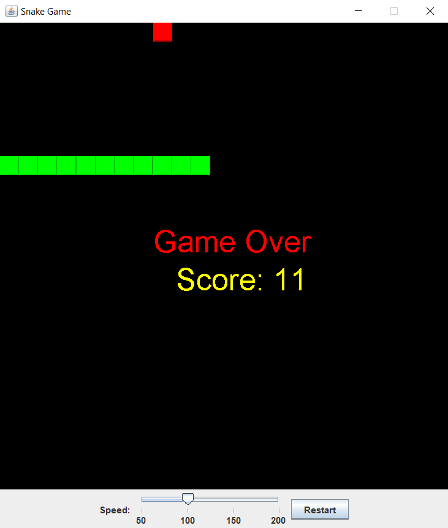

# Snake Game Project

## Introduction
This project is a modern implementation of the classic Snake game, designed using Java and the Swing framework. The game features a simple graphical interface where a snake navigates a grid to consume food, growing longer with each piece of food it eats. The objective is to grow the snake as long as possible without colliding with the walls or itself. This project is ideal for beginners learning Java or for anyone interested in understanding event-driven programming and basic game development concepts.

## Game Screenshots

### Gameplay Screen

  

### Color Customization

  

### Game Over Screen

  

## Features
- **Adjustable Speed**: Players can adjust the speed of the snake using a slider. The speed ranges from slow to fast, providing a customizable game experience.
- **Color Customization**: The color of the snake can be changed dynamically during the game by pressing the 'C' key, adding a visual customization aspect to the gameplay.
- **Restart Button**: A restart button is available, allowing players to quickly restart the game after a game over without needing to relaunch the application.
- **Score Display**: The player's current score is displayed in real-time during the game, and the final score is shown when the game ends.

## Controls
- **Arrow Keys**: Control the direction of the snake (Up, Down, Left, Right).
- **'C' Key**: Change the color of the snake.
- **Speed Slider**: Adjust the speed of the snake. Moving the slider to the left makes the snake move slower, while moving it to the right increases the speed.
- **Restart Button**: Click to restart the game after a game over.

## Programming Techniques
- **Event-Driven Programming**: The game uses the Swing framework, which relies on event-driven programming. Key events are captured using the `KeyListener` interface, and timer events are handled using the `ActionListener` interface.
- **Custom Drawing**: The game's graphics are rendered using the `paintComponent` method of the `JPanel` class. This method is overridden to draw the snake, food, and other game elements.
- **Game Loop**: A `Timer` object is used to create the game loop, which updates the game state and refreshes the screen at regular intervals.
- **Collision Detection**: The game includes basic collision detection logic to handle interactions between the snake and the food, walls, and itself.
- **Dynamic UI Updates**: The game's speed and snake color can be dynamically adjusted during gameplay, demonstrating how to create interactive and responsive Java Swing applications.

## Conclusion
This Snake game project is a practical example of using Java and Swing to create an interactive and enjoyable game. It showcases fundamental programming concepts such as event handling, custom painting, and game loop management. The project is structured to be easily understandable and modifiable, making it a great learning resource for Java developers and game development enthusiasts.

## Getting Started
Clone the repository, open it in your preferred Java IDE, and run the `App` class to start the game. Use the arrow keys to control the snake, adjust the speed with the slider, and enjoy the game!
